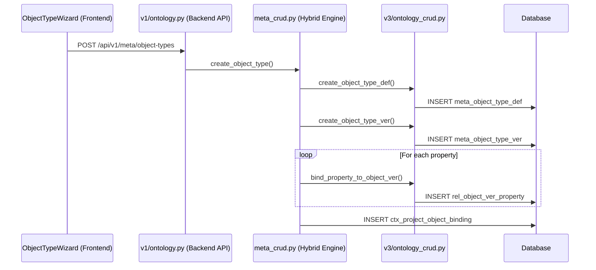
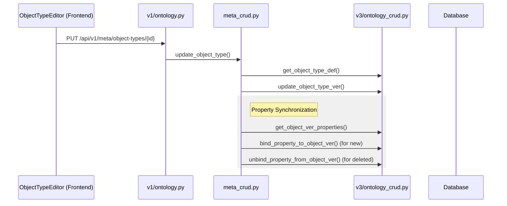
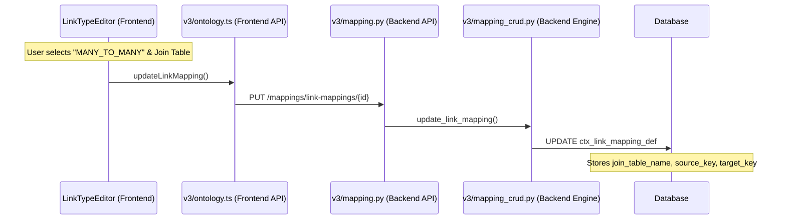
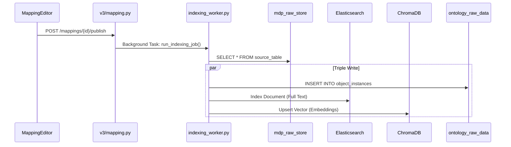
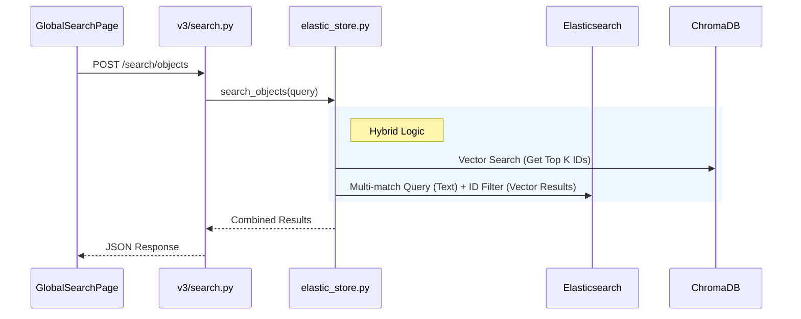

# MDP Business Flows & Call Graphs

## 1. Object Type Management

### 1.1 Create Object Type (V3 Flow)

**Scenario**: User creates a new "Aircraft" object type in Studio.

### 1.2 Edit Object Type (V3 Flow)

**Scenario**: User adds a property to "Aircraft".

## 2. Link Type Management

### 2.1 Edit Link Type & Mapping (M:N)

**Scenario**: User configures a Many-to-Many link "Aircraft <-> Pilot" using a join table.

## 3. Data Ingestion & Indexing

### 3.1 Publish Mapping (Triple Write)

**Scenario**: User publishes a mapping to sync data.

## 4. Search & Retrieval

### 4.1 Hybrid Search

**Scenario**: User searches for "Boeing engine failure".

