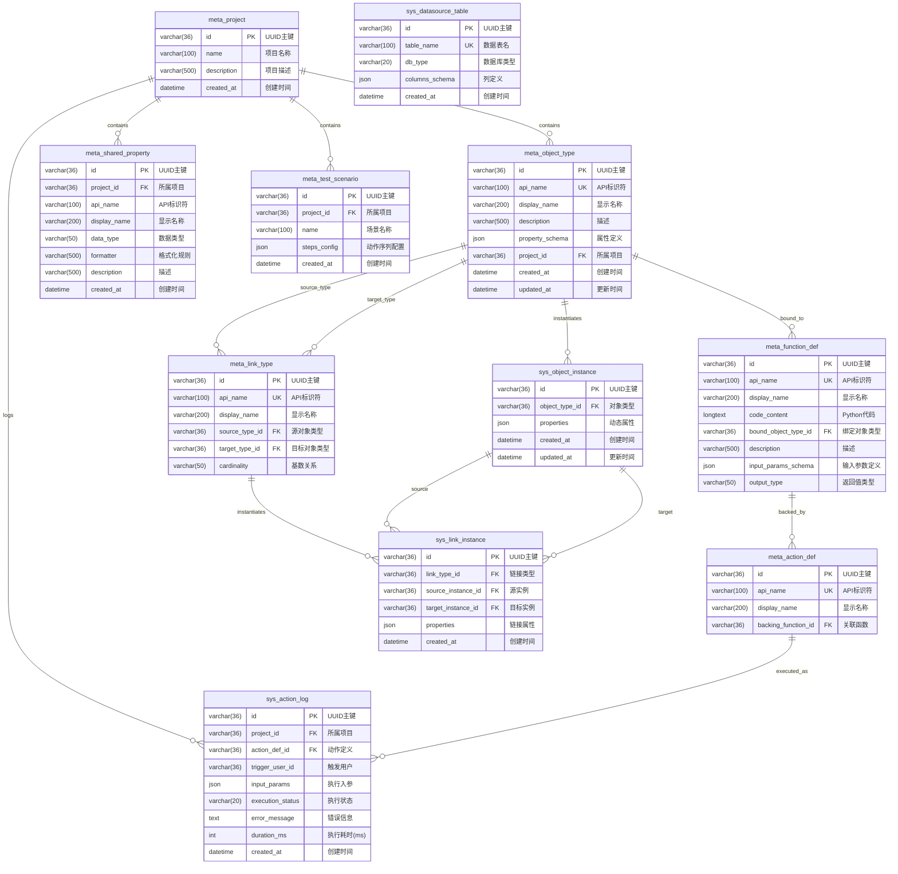

# MDP Platform 数据库架构设计

## ER图



## 表结构详细说明

### 1. Meta Layer (定义层)

#### 1.1 meta_project - 项目定义
| 字段 | 类型 | 约束 | 说明 |
|------|------|------|------|
| id | VARCHAR(36) | PK | UUID主键 |
| name | VARCHAR(100) | NOT NULL | 项目名称 |
| description | VARCHAR(500) | | 项目描述 |
| created_at | DATETIME | DEFAULT NOW | 创建时间 |

#### 1.2 meta_object_type - 对象类型定义
| 字段 | 类型 | 约束 | 说明 |
|------|------|------|------|
| id | VARCHAR(36) | PK | UUID主键 |
| api_name | VARCHAR(100) | UNIQUE | API标识符，如 `fighter` |
| display_name | VARCHAR(200) | NOT NULL | 显示名称，如 `战斗机` |
| description | VARCHAR(500) | | 描述 |
| property_schema | JSON | | 属性定义列表 |
| project_id | VARCHAR(36) | FK → meta_project | 所属项目 |
| created_at | DATETIME | DEFAULT NOW | 创建时间 |
| updated_at | DATETIME | ON UPDATE NOW | 更新时间 |

#### 1.3 meta_link_type - 链接类型定义
| 字段 | 类型 | 约束 | 说明 |
|------|------|------|------|
| id | VARCHAR(36) | PK | UUID主键 |
| api_name | VARCHAR(100) | UNIQUE | API标识符 |
| display_name | VARCHAR(200) | NOT NULL | 显示名称 |
| source_type_id | VARCHAR(36) | FK → meta_object_type | 源对象类型 |
| target_type_id | VARCHAR(36) | FK → meta_object_type | 目标对象类型 |
| cardinality | VARCHAR(50) | DEFAULT 'MANY_TO_MANY' | 基数：ONE_TO_ONE, ONE_TO_MANY, MANY_TO_MANY |

#### 1.4 meta_function_def - 函数定义
| 字段 | 类型 | 约束 | 说明 |
|------|------|------|------|
| id | VARCHAR(36) | PK | UUID主键 |
| api_name | VARCHAR(100) | UNIQUE | API标识符 |
| display_name | VARCHAR(200) | NOT NULL | 显示名称 |
| code_content | LONGTEXT | | Python代码内容 |
| bound_object_type_id | VARCHAR(36) | FK → meta_object_type | 绑定的对象类型 |
| description | VARCHAR(500) | | 函数描述 |
| input_params_schema | JSON | | 输入参数定义 |
| output_type | VARCHAR(50) | DEFAULT 'VOID' | 返回值类型 |

#### 1.5 meta_action_def - 动作定义
| 字段 | 类型 | 约束 | 说明 |
|------|------|------|------|
| id | VARCHAR(36) | PK | UUID主键 |
| api_name | VARCHAR(100) | UNIQUE | API标识符 |
| display_name | VARCHAR(200) | NOT NULL | 显示名称 |
| backing_function_id | VARCHAR(36) | FK → meta_function_def | 关联的函数 |

#### 1.6 meta_shared_property - 共享属性定义
| 字段 | 类型 | 约束 | 说明 |
|------|------|------|------|
| id | VARCHAR(36) | PK | UUID主键 |
| project_id | VARCHAR(36) | FK → meta_project | 所属项目 |
| api_name | VARCHAR(100) | NOT NULL | API标识符 |
| display_name | VARCHAR(200) | NOT NULL | 显示名称 |
| data_type | VARCHAR(50) | NOT NULL | 数据类型：STRING, INTEGER, DOUBLE, BOOLEAN, DATE, GEOPOINT |
| formatter | VARCHAR(500) | | 格式化规则（JSON） |
| description | VARCHAR(500) | | 描述 |
| created_at | DATETIME | DEFAULT NOW | 创建时间 |

#### 1.7 meta_test_scenario - 测试场景定义
| 字段 | 类型 | 约束 | 说明 |
|------|------|------|------|
| id | VARCHAR(36) | PK | UUID主键 |
| project_id | VARCHAR(36) | FK → meta_project | 所属项目 |
| name | VARCHAR(100) | | 场景名称 |
| steps_config | JSON | | 动作序列配置 |
| created_at | DATETIME | DEFAULT NOW | 创建时间 |

### 2. Instance Layer (实例层)

#### 2.1 sys_object_instance - 对象实例
| 字段 | 类型 | 约束 | 说明 |
|------|------|------|------|
| id | VARCHAR(36) | PK | UUID主键 |
| object_type_id | VARCHAR(36) | FK → meta_object_type | 对象类型 |
| properties | JSON | | 动态属性，如 `{"name": "F-22", "fuel": 80}` |
| created_at | DATETIME | DEFAULT NOW | 创建时间 |
| updated_at | DATETIME | ON UPDATE NOW | 更新时间 |

#### 2.2 sys_link_instance - 链接实例
| 字段 | 类型 | 约束 | 说明 |
|------|------|------|------|
| id | VARCHAR(36) | PK | UUID主键 |
| link_type_id | VARCHAR(36) | FK → meta_link_type | 链接类型 |
| source_instance_id | VARCHAR(36) | FK → sys_object_instance | 源实例 |
| target_instance_id | VARCHAR(36) | FK → sys_object_instance | 目标实例 |
| properties | JSON | | 链接属性，如 `{"role": "Leader"}` |
| created_at | DATETIME | DEFAULT NOW | 创建时间 |

#### 2.3 sys_datasource_table - 数据源表定义
| 字段 | 类型 | 约束 | 说明 |
|------|------|------|------|
| id | VARCHAR(36) | PK | UUID主键 |
| table_name | VARCHAR(100) | UNIQUE | 原始数据表名 |
| db_type | VARCHAR(20) | DEFAULT 'MySQL' | 数据库类型 |
| columns_schema | JSON | | 列定义 |
| created_at | DATETIME | DEFAULT NOW | 创建时间 |

### 3. Runtime Layer (运行时层)

#### 3.1 sys_action_log - 动作执行日志
| 字段 | 类型 | 约束 | 说明 |
|------|------|------|------|
| id | VARCHAR(36) | PK | UUID主键 |
| project_id | VARCHAR(36) | FK → meta_project | 所属项目 |
| action_def_id | VARCHAR(36) | FK → meta_action_def | 动作定义 |
| trigger_user_id | VARCHAR(36) | | 触发用户 |
| input_params | JSON | | 执行入参 |
| execution_status | VARCHAR(20) | | 执行状态：SUCCESS, FAILED |
| error_message | TEXT | | 错误信息 |
| duration_ms | INT | | 执行耗时(毫秒) |
| created_at | DATETIME | DEFAULT NOW | 创建时间 |

---

## 测试数据

### 1. 项目数据

```sql
INSERT INTO meta_project (id, name, description, created_at) VALUES
('proj-001', '战场态势感知系统', '基于本体的战场态势感知与决策支持系统，支持多源情报融合与行动方案规划', NOW()),
('proj-002', '智能供应链管理', '供应链全流程本体建模与优化系统，支持多式联运路径优化', NOW()),
('proj-003', '医疗知识图谱', '医疗领域知识图谱构建与推理系统，支持用药安全校验', NOW());
```

### 2. 对象类型数据

```sql
INSERT INTO meta_object_type (id, api_name, display_name, description, property_schema, project_id, created_at, updated_at) VALUES

-- ============================================================
-- 项目1：战场态势感知系统 (proj-001)
-- ============================================================

-- 基础作战单元
('ot-fighter', 'fighter', '战斗机', '空中作战单元', 
 '{"properties": [
    {"key": "callsign", "type": "STRING", "label": "呼号"},
    {"key": "model", "type": "STRING", "label": "机型"},
    {"key": "fuel", "type": "INTEGER", "label": "燃油(%)"},
    {"key": "status", "type": "STRING", "label": "状态"},
    {"key": "position", "type": "GEOPOINT", "label": "位置"}
  ]}',
 'proj-001', NOW(), NOW()),

('ot-target', 'target', '目标', '打击目标', 
 '{"properties": [
    {"key": "name", "type": "STRING", "label": "名称"},
    {"key": "type", "type": "STRING", "label": "类型"},
    {"key": "threat_level", "type": "INTEGER", "label": "威胁等级"},
    {"key": "position", "type": "GEOPOINT", "label": "位置"},
    {"key": "is_destroyed", "type": "BOOLEAN", "label": "已摧毁"}
  ]}',
 'proj-001', NOW(), NOW()),

('ot-mission', 'mission', '任务', '作战任务', 
 '{"properties": [
    {"key": "name", "type": "STRING", "label": "任务名称"},
    {"key": "type", "type": "STRING", "label": "任务类型"},
    {"key": "priority", "type": "INTEGER", "label": "优先级"},
    {"key": "status", "type": "STRING", "label": "状态"},
    {"key": "start_time", "type": "DATE", "label": "开始时间"}
  ]}',
 'proj-001', NOW(), NOW()),

-- 情报与方案扩展
('ot-intel', 'intel_report', '情报报告', '来自SIGINT/ELINT的原始情报', 
 '{"properties": [
    {"key": "source", "type": "STRING", "label": "来源"},
    {"key": "confidence", "type": "INTEGER", "label": "置信度(%)"},
    {"key": "content", "type": "STRING", "label": "内容摘要"},
    {"key": "timestamp", "type": "DATETIME", "label": "获取时间"}
  ]}',
 'proj-001', NOW(), NOW()),

('ot-image', 'surveillance_image', '侦察图像', 'IMINT图像数据', 
 '{"properties": [
    {"key": "platform", "type": "STRING", "label": "拍摄平台"},
    {"key": "url", "type": "STRING", "label": "图像链接"},
    {"key": "resolution", "type": "STRING", "label": "分辨率"}
  ]}',
 'proj-001', NOW(), NOW()),

('ot-coa', 'course_of_action', '行动方案', '针对目标的应对计划', 
 '{"properties": [
    {"key": "name", "type": "STRING", "label": "方案名称"},
    {"key": "type", "type": "STRING", "label": "类型"},
    {"key": "risk_level", "type": "STRING", "label": "风险等级"},
    {"key": "estimated_cost", "type": "INTEGER", "label": "预估成本"}
  ]}',
 'proj-001', NOW(), NOW()),

-- ============================================================
-- 项目2：智能供应链管理 (proj-002)
-- ============================================================

('ot-warehouse', 'warehouse', '仓库', '存储设施', 
 '{"properties": [
    {"key": "name", "type": "STRING", "label": "仓库名称"},
    {"key": "location", "type": "STRING", "label": "位置"},
    {"key": "capacity", "type": "INTEGER", "label": "容量"},
    {"key": "utilization", "type": "DOUBLE", "label": "利用率"}
  ]}',
 'proj-002', NOW(), NOW()),

('ot-product', 'product', '产品', '库存产品', 
 '{"properties": [
    {"key": "sku", "type": "STRING", "label": "SKU"},
    {"key": "name", "type": "STRING", "label": "名称"},
    {"key": "quantity", "type": "INTEGER", "label": "数量"},
    {"key": "unit_price", "type": "DOUBLE", "label": "单价"}
  ]}',
 'proj-002', NOW(), NOW()),

-- 多式联运扩展
('ot-rail-station', 'rail_station', '铁路货运站', '铁路物流节点', 
 '{"properties": [
    {"key": "name", "type": "STRING", "label": "站名"},
    {"key": "handling_capacity", "type": "INTEGER", "label": "吞吐能力(TEU)"},
    {"key": "location", "type": "GEOPOINT", "label": "位置"}
  ]}',
 'proj-002', NOW(), NOW()),

('ot-factory', 'factory', '制造工厂', '生产源头', 
 '{"properties": [
    {"key": "name", "type": "STRING", "label": "工厂名称"},
    {"key": "output_daily", "type": "INTEGER", "label": "日产量"}
  ]}',
 'proj-002', NOW(), NOW()),

-- ============================================================
-- 项目3：医疗知识图谱 (proj-003)
-- ============================================================

('ot-disease', 'disease', '疾病', '疾病实体', 
 '{"properties": [
    {"key": "name", "type": "STRING", "label": "疾病名称"},
    {"key": "icd_code", "type": "STRING", "label": "ICD编码"},
    {"key": "category", "type": "STRING", "label": "分类"},
    {"key": "description", "type": "STRING", "label": "描述"}
  ]}',
 'proj-003', NOW(), NOW()),

('ot-symptom', 'symptom', '症状', '症状表现', 
 '{"properties": [
    {"key": "name", "type": "STRING", "label": "症状名称"},
    {"key": "severity", "type": "STRING", "label": "严重程度"},
    {"key": "body_part", "type": "STRING", "label": "部位"}
  ]}',
 'proj-003', NOW(), NOW()),

-- 患者与药物扩展
('ot-patient', 'patient', '患者', '就诊人员', 
 '{"properties": [
    {"key": "name", "type": "STRING", "label": "姓名"},
    {"key": "age", "type": "INTEGER", "label": "年龄"},
    {"key": "gender", "type": "STRING", "label": "性别"}
  ]}',
 'proj-003', NOW(), NOW()),

('ot-drug', 'drug', '药物', '治疗药品', 
 '{"properties": [
    {"key": "name", "type": "STRING", "label": "通用名"},
    {"key": "class", "type": "STRING", "label": "药物类别"},
    {"key": "dosage", "type": "STRING", "label": "规格"}
  ]}',
 'proj-003', NOW(), NOW());
```

### 3. 链接类型数据

```sql
INSERT INTO meta_link_type (id, api_name, display_name, source_type_id, target_type_id, cardinality) VALUES

-- ============================================================
-- 项目1：战场态势感知系统
-- ============================================================

-- 基础关系
('lt-assigned-to', 'assigned_to', '分配到', 'ot-fighter', 'ot-mission', 'MANY_TO_MANY'),
('lt-targets', 'targets', '打击目标', 'ot-mission', 'ot-target', 'MANY_TO_MANY'),
('lt-escorts', 'escorts', '护航', 'ot-fighter', 'ot-fighter', 'MANY_TO_MANY'),

-- 情报融合关系
('lt-corroborates', 'corroborates', '佐证', 'ot-intel', 'ot-target', 'MANY_TO_ONE'),
('lt-depicts', 'depicts', '描绘', 'ot-image', 'ot-target', 'MANY_TO_ONE'),
('lt-plan-target', 'plans_against', '针对', 'ot-coa', 'ot-target', 'MANY_TO_ONE'),

-- ============================================================
-- 项目2：智能供应链管理
-- ============================================================

-- 基础关系
('lt-stored-in', 'stored_in', '存储于', 'ot-product', 'ot-warehouse', 'MANY_TO_ONE'),

-- 多式联运关系
('lt-road-link', 'road_connection', '公路运输线', 'ot-factory', 'ot-warehouse', 'MANY_TO_MANY'),
('lt-road-feeder', 'road_feeder', '短驳运输', 'ot-factory', 'ot-rail-station', 'MANY_TO_MANY'),
('lt-rail-link', 'rail_connection', '铁路干线', 'ot-rail-station', 'ot-rail-station', 'MANY_TO_MANY'),
('lt-last-mile', 'last_mile', '最后一公里', 'ot-rail-station', 'ot-warehouse', 'MANY_TO_MANY'),

-- ============================================================
-- 项目3：医疗知识图谱
-- ============================================================

-- 基础关系
('lt-has-symptom', 'has_symptom', '伴有症状', 'ot-disease', 'ot-symptom', 'MANY_TO_MANY'),

-- 诊疗关系
('lt-diagnosed-with', 'diagnosed_with', '确诊', 'ot-patient', 'ot-disease', 'MANY_TO_MANY'),
('lt-treats', 'treats', '治疗', 'ot-drug', 'ot-disease', 'MANY_TO_MANY'),
('lt-contra', 'contraindication', '禁忌', 'ot-drug', 'ot-disease', 'MANY_TO_MANY');
```

### 4. 共享属性数据

```sql
INSERT INTO meta_shared_property (id, project_id, api_name, display_name, data_type, formatter, description, created_at) VALUES
-- 战场态势感知系统
('sp-001', 'proj-001', 'geo_position', '地理位置', 'GEOPOINT', '{"format": "DMS"}', '经纬度坐标', NOW()),
('sp-002', 'proj-001', 'operational_status', '运行状态', 'STRING', '{"enum": ["Ready", "Active", "Maintenance", "Offline"]}', '设备运行状态', NOW()),
('sp-003', 'proj-001', 'threat_level', '威胁等级', 'INTEGER', '{"min": 1, "max": 5}', '1-5级威胁评估', NOW()),
('sp-004', 'proj-001', 'confidence', '置信度', 'INTEGER', '{"min": 0, "max": 100}', '情报置信度百分比', NOW()),

-- 智能供应链管理
('sp-005', 'proj-002', 'quantity', '数量', 'INTEGER', '{"min": 0}', '库存数量', NOW()),
('sp-006', 'proj-002', 'unit_price', '单价', 'DOUBLE', '{"currency": "CNY", "precision": 2}', '商品单价', NOW()),
('sp-007', 'proj-002', 'cost_per_ton', '吨公里成本', 'DOUBLE', '{"currency": "CNY"}', '运输成本', NOW()),

-- 医疗知识图谱
('sp-008', 'proj-003', 'icd_code', 'ICD编码', 'STRING', '{"pattern": "^[A-Z][0-9]{2}(\\.[0-9]{1,2})?$"}', '国际疾病分类编码', NOW()),
('sp-009', 'proj-003', 'severity', '严重程度', 'STRING', '{"enum": ["轻度", "中度", "重度"]}', '病情/症状严重程度', NOW());
```

### 5. 函数定义数据

```sql
INSERT INTO meta_function_def (id, api_name, display_name, code_content, bound_object_type_id, description, input_params_schema, output_type) VALUES
('fn-strike', 'execute_strike', '执行打击', 
'def execute(ctx, params):
    """执行对目标的打击任务"""
    target_id = params.get("target_id")
    fighter_id = params.get("fighter_id")
    
    # 获取战斗机和目标
    fighter = ctx.get_object(fighter_id)
    target = ctx.get_object(target_id)
    
    # 检查燃油
    if fighter["properties"]["fuel"] < 20:
        return {"success": False, "message": "燃油不足"}
    
    # 执行打击
    ctx.update_object(target_id, {"is_destroyed": True})
    ctx.update_object(fighter_id, {"fuel": fighter["properties"]["fuel"] - 15})
    
    return {"success": True, "message": f"目标 {target_id} 已被摧毁"}',
'ot-fighter', '战斗机执行对目标的打击任务',
'[{"name": "target_id", "type": "STRING", "required": true, "label": "目标ID"},
  {"name": "fighter_id", "type": "STRING", "required": true, "label": "战斗机ID"}]',
'OBJECT'),

('fn-refuel', 'refuel_fighter', '加油', 
'def execute(ctx, params):
    """为战斗机加油"""
    fighter_id = params.get("fighter_id")
    amount = params.get("amount", 100)
    
    fighter = ctx.get_object(fighter_id)
    current_fuel = fighter["properties"]["fuel"]
    new_fuel = min(100, current_fuel + amount)
    
    ctx.update_object(fighter_id, {"fuel": new_fuel})
    return {"success": True, "new_fuel": new_fuel}',
'ot-fighter', '为战斗机补充燃油',
'[{"name": "fighter_id", "type": "STRING", "required": true, "label": "战斗机ID"},
  {"name": "amount", "type": "INTEGER", "required": false, "label": "加油量", "default": 100}]',
'OBJECT'),

('fn-transfer', 'transfer_product', '调拨产品', 
'def execute(ctx, params):
    """在仓库间调拨产品"""
    product_id = params.get("product_id")
    target_warehouse_id = params.get("target_warehouse_id")
    quantity = params.get("quantity")
    
    # 更新产品所在仓库
    ctx.delete_link(product_id, "stored_in")
    ctx.create_link("stored_in", product_id, target_warehouse_id)
    
    return {"success": True, "message": "调拨完成"}',
'ot-product', '在仓库间调拨产品',
'[{"name": "product_id", "type": "STRING", "required": true},
  {"name": "target_warehouse_id", "type": "STRING", "required": true},
  {"name": "quantity", "type": "INTEGER", "required": true}]',
'OBJECT');
```

### 6. 动作定义数据

```sql
INSERT INTO meta_action_def (id, api_name, display_name, backing_function_id) VALUES
('act-strike', 'strike', '打击目标', 'fn-strike'),
('act-refuel', 'refuel', '空中加油', 'fn-refuel'),
('act-transfer', 'transfer', '产品调拨', 'fn-transfer');
```

### 7. 对象实例数据

```sql
INSERT INTO sys_object_instance (id, object_type_id, properties, created_at, updated_at) VALUES

-- ============================================================
-- 项目1：战场态势感知系统
-- ============================================================

-- 战斗机实例
('inst-f22-001', 'ot-fighter', 
 '{"callsign": "Eagle-1", "model": "F-22", "fuel": 85, "status": "Ready", "position": {"lat": 39.9042, "lng": 116.4074}}',
 NOW(), NOW()),
('inst-f22-002', 'ot-fighter', 
 '{"callsign": "Eagle-2", "model": "F-22", "fuel": 72, "status": "Active", "position": {"lat": 39.9142, "lng": 116.4174}}',
 NOW(), NOW()),
('inst-j20-001', 'ot-fighter', 
 '{"callsign": "Dragon-1", "model": "J-20", "fuel": 90, "status": "Ready", "position": {"lat": 31.2304, "lng": 121.4737}}',
 NOW(), NOW()),

-- 目标实例
('inst-tgt-001', 'ot-target', 
 '{"name": "目标Alpha", "type": "地面设施", "threat_level": 4, "position": {"lat": 40.0, "lng": 117.0}, "is_destroyed": false}',
 NOW(), NOW()),
('inst-tgt-002', 'ot-target', 
 '{"name": "目标Bravo", "type": "雷达站", "threat_level": 3, "position": {"lat": 40.1, "lng": 117.1}, "is_destroyed": false}',
 NOW(), NOW()),
-- 高价值目标（融合后）
('inst-tgt-s400', 'ot-target', 
 '{"name": "S-400发射阵地", "type": "防空导弹", "threat_level": 5, "position": {"lat": 40.5, "lng": 117.8}, "is_destroyed": false}',
 NOW(), NOW()),

-- 任务实例
('inst-msn-001', 'ot-mission', 
 '{"name": "猎鹰行动", "type": "空中打击", "priority": 1, "status": "Planning", "start_time": "2024-01-15T08:00:00"}',
 NOW(), NOW()),

-- 情报实例
('inst-intel-001', 'ot-intel', 
 '{"source": "Sat-ELINT-09", "confidence": 75, "content": "检测到高频雷达信号，特征匹配S-300/400系列", "timestamp": "2024-01-15T09:00:00"}',
 NOW(), NOW()),

-- 侦察图像实例
('inst-img-001', 'ot-image', 
 '{"platform": "UAV-Predator", "url": "/images/rec/20240115_001.jpg", "resolution": "4K"}',
 NOW(), NOW()),

-- 行动方案实例
('inst-coa-a', 'ot-coa', 
 '{"name": "方案A: 电子压制", "type": "Soft-Kill", "risk_level": "Low", "estimated_cost": 50000}',
 NOW(), NOW()),
('inst-coa-b', 'ot-coa', 
 '{"name": "方案B: 防区外打击", "type": "Hard-Kill", "risk_level": "Medium", "estimated_cost": 2000000}',
 NOW(), NOW()),

-- ============================================================
-- 项目2：智能供应链管理
-- ============================================================

-- 仓库实例
('inst-wh-001', 'ot-warehouse', 
 '{"name": "华东配送中心", "location": "上海", "capacity": 10000, "utilization": 0.75}',
 NOW(), NOW()),
('inst-wh-002', 'ot-warehouse', 
 '{"name": "华北配送中心", "location": "北京", "capacity": 8000, "utilization": 0.60}',
 NOW(), NOW()),

-- 产品实例
('inst-prod-001', 'ot-product', 
 '{"sku": "SKU-001", "name": "智能手机A", "quantity": 500, "unit_price": 2999.00}',
 NOW(), NOW()),
('inst-prod-002', 'ot-product', 
 '{"sku": "SKU-002", "name": "笔记本电脑B", "quantity": 200, "unit_price": 5999.00}',
 NOW(), NOW()),

-- 工厂实例
('inst-fac-001', 'ot-factory', 
 '{"name": "苏州制造基地", "output_daily": 5000}',
 NOW(), NOW()),

-- 铁路站点实例
('inst-rail-suzhou', 'ot-rail-station', 
 '{"name": "苏州西站", "handling_capacity": 2000, "location": {"lat": 31.3, "lng": 120.5}}',
 NOW(), NOW()),
('inst-rail-beijing', 'ot-rail-station', 
 '{"name": "北京丰台站", "handling_capacity": 3000, "location": {"lat": 39.8, "lng": 116.3}}',
 NOW(), NOW()),

-- ============================================================
-- 项目3：医疗知识图谱
-- ============================================================

-- 疾病实例
('inst-dis-001', 'ot-disease', 
 '{"name": "2型糖尿病", "icd_code": "E11", "category": "内分泌疾病", "description": "以高血糖为特征的代谢性疾病"}',
 NOW(), NOW()),

-- 症状实例
('inst-sym-001', 'ot-symptom', 
 '{"name": "多饮", "severity": "中度", "body_part": "全身"}',
 NOW(), NOW()),
('inst-sym-002', 'ot-symptom', 
 '{"name": "多尿", "severity": "中度", "body_part": "泌尿系统"}',
 NOW(), NOW()),

-- 患者实例
('inst-pat-wang', 'ot-patient', 
 '{"name": "王五", "age": 58, "gender": "男"}',
 NOW(), NOW()),

-- 药物实例
('inst-drug-beta', 'ot-drug', 
 '{"name": "普萘洛尔", "class": "β受体阻滞剂", "dosage": "10mg"}',
 NOW(), NOW()),
('inst-drug-acei', 'ot-drug', 
 '{"name": "卡托普利", "class": "ACEI", "dosage": "25mg"}',
 NOW(), NOW());
```

### 8. 链接实例数据

```sql
INSERT INTO sys_link_instance (id, link_type_id, source_instance_id, target_instance_id, properties, created_at) VALUES

-- ============================================================
-- 项目1：战场态势感知系统
-- ============================================================

-- 战斗机分配到任务
('link-001', 'lt-assigned-to', 'inst-f22-001', 'inst-msn-001', '{"role": "Leader"}', NOW()),
('link-002', 'lt-assigned-to', 'inst-f22-002', 'inst-msn-001', '{"role": "Wingman"}', NOW()),

-- 任务打击目标
('link-003', 'lt-targets', 'inst-msn-001', 'inst-tgt-001', '{"priority": 1}', NOW()),
('link-004', 'lt-targets', 'inst-msn-001', 'inst-tgt-002', '{"priority": 2}', NOW()),

-- 战斗机护航
('link-005', 'lt-escorts', 'inst-j20-001', 'inst-f22-001', '{"distance_km": 5}', NOW()),

-- 情报融合关系
('link-intel-tgt', 'lt-corroborates', 'inst-intel-001', 'inst-tgt-s400', '{"match_score": 0.85}', NOW()),
('link-img-tgt', 'lt-depicts', 'inst-img-001', 'inst-tgt-s400', '{"visual_confirm": true}', NOW()),

-- 行动方案关系
('link-coa-a', 'lt-plan-target', 'inst-coa-a', 'inst-tgt-s400', NULL, NOW()),
('link-coa-b', 'lt-plan-target', 'inst-coa-b', 'inst-tgt-s400', NULL, NOW()),

-- ============================================================
-- 项目2：智能供应链管理
-- ============================================================

-- 产品存储于仓库
('link-006', 'lt-stored-in', 'inst-prod-001', 'inst-wh-001', NULL, NOW()),
('link-007', 'lt-stored-in', 'inst-prod-002', 'inst-wh-002', NULL, NOW()),

-- 方案A：纯公路直发 (现状 - 低效)
('link-road-direct', 'lt-road-link', 'inst-fac-001', 'inst-wh-002', 
 '{"distance_km": 1200, "cost_per_ton": 800, "transit_time_h": 18, "co2_kg": 150}', NOW()),

-- 方案B：多式联运 (优化目标)
-- 第一段：苏州工厂 -> 苏州西站 (短驳 30km)
('link-opt-1', 'lt-road-feeder', 'inst-fac-001', 'inst-rail-suzhou', 
 '{"distance_km": 30, "cost_per_ton": 50, "transit_time_h": 1, "co2_kg": 5}', NOW()),

-- 第二段：苏州西站 -> 北京丰台站 (铁路干线 1100km)
('link-opt-2', 'lt-rail-link', 'inst-rail-suzhou', 'inst-rail-beijing', 
 '{"distance_km": 1100, "cost_per_ton": 200, "transit_time_h": 24, "co2_kg": 20}', NOW()),

-- 第三段：北京丰台站 -> 华北仓 (末端配送 40km)
('link-opt-3', 'lt-last-mile', 'inst-rail-beijing', 'inst-wh-002', 
 '{"distance_km": 40, "cost_per_ton": 60, "transit_time_h": 2, "co2_kg": 6}', NOW()),

-- ============================================================
-- 项目3：医疗知识图谱
-- ============================================================

-- 疾病-症状关联
('link-008', 'lt-has-symptom', 'inst-dis-001', 'inst-sym-001', '{"frequency": "常见"}', NOW()),
('link-009', 'lt-has-symptom', 'inst-dis-001', 'inst-sym-002', '{"frequency": "常见"}', NOW()),

-- 患者确诊疾病
('link-diag-001', 'lt-diagnosed-with', 'inst-pat-wang', 'inst-dis-001', '{"date": "2023-01-01"}', NOW()),

-- 药物-疾病关系
('link-warn-001', 'lt-contra', 'inst-drug-beta', 'inst-dis-001', '{"reason": "可能掩盖低血糖症状", "level": "High"}', NOW()),
('link-treat-001', 'lt-treats', 'inst-drug-acei', 'inst-dis-001', '{"efficacy": "First Line"}', NOW());
```

### 9. 数据源表数据

```sql
INSERT INTO sys_datasource_table (id, table_name, db_type, columns_schema, created_at) VALUES
('ds-001', 'raw_aircraft_data', 'MySQL', 
 '[{"name": "id", "type": "INT", "primary_key": true},
   {"name": "callsign", "type": "VARCHAR(50)"},
   {"name": "model", "type": "VARCHAR(50)"},
   {"name": "fuel_level", "type": "INT"},
   {"name": "lat", "type": "DECIMAL(10,6)"},
   {"name": "lng", "type": "DECIMAL(10,6)"}]',
 NOW()),

('ds-002', 'raw_inventory_data', 'MySQL', 
 '[{"name": "sku", "type": "VARCHAR(50)", "primary_key": true},
   {"name": "product_name", "type": "VARCHAR(200)"},
   {"name": "stock_qty", "type": "INT"},
   {"name": "price", "type": "DECIMAL(10,2)"},
   {"name": "warehouse_code", "type": "VARCHAR(20)"}]',
 NOW()),

('ds-003', 'raw_intel_feed', 'MySQL', 
 '[{"name": "id", "type": "INT", "primary_key": true},
   {"name": "source_platform", "type": "VARCHAR(50)"},
   {"name": "signal_type", "type": "VARCHAR(50)"},
   {"name": "confidence_pct", "type": "INT"},
   {"name": "raw_content", "type": "TEXT"},
   {"name": "captured_at", "type": "DATETIME"}]',
 NOW());
```

### 10. 执行日志数据

```sql
INSERT INTO sys_action_log (id, project_id, action_def_id, trigger_user_id, input_params, execution_status, error_message, duration_ms, created_at) VALUES
('log-001', 'proj-001', 'act-strike', 'user-001', 
 '{"target_id": "inst-tgt-001", "fighter_id": "inst-f22-001"}',
 'SUCCESS', NULL, 156, NOW()),

('log-002', 'proj-001', 'act-refuel', 'user-001', 
 '{"fighter_id": "inst-f22-002", "amount": 50}',
 'SUCCESS', NULL, 89, NOW()),

('log-003', 'proj-002', 'act-transfer', 'user-002', 
 '{"product_id": "inst-prod-001", "target_warehouse_id": "inst-wh-002", "quantity": 100}',
 'FAILED', '目标仓库容量不足', 234, NOW());
```

---

## 数据统计

### 按项目统计

| 项目 | 对象类型 | 链接类型 | 对象实例 | 链接实例 |
|------|----------|----------|----------|----------|
| 战场态势感知系统 | 6 | 6 | 11 | 9 |
| 智能供应链管理 | 4 | 5 | 7 | 7 |
| 医疗知识图谱 | 4 | 4 | 6 | 5 |
| **合计** | **14** | **15** | **24** | **21** |

### 业务场景说明

#### 场景1：多源情报融合 (战场态势感知)
```
信号情报(ELINT) ──佐证──> 目标(S-400)
                            ↑
侦察图像(IMINT) ──描绘──┘
                            ↓
行动方案A(电子压制) ──针对──> 目标
行动方案B(防区外打击) ──针对──> 目标
```

#### 场景2：多式联运路径优化 (供应链)
```
方案A（纯公路）: 苏州工厂 ═══公路1200km═══> 华北仓
                成本: 800元/吨, 时效: 18小时

方案B（多式联运）: 
苏州工厂 ──短驳30km──> 苏州西站 ══铁路1100km══> 北京丰台 ──末端40km──> 华北仓
                成本: 310元/吨 (节省61%), 时效: 27小时
```

#### 场景3：用药安全校验 (医疗知识图谱)
```
患者(王五,58岁) ──确诊──> 2型糖尿病
                              ↑
普萘洛尔(β阻滞剂) ──禁忌──┘ (可能掩盖低血糖症状)
卡托普利(ACEI) ──治疗──┘ (一线用药)
```

---

## 完整SQL脚本执行顺序

1. `meta_project` - 项目定义
2. `meta_object_type` - 对象类型定义
3. `meta_link_type` - 链接类型定义
4. `meta_shared_property` - 共享属性定义
5. `meta_function_def` - 函数定义
6. `meta_action_def` - 动作定义
7. `sys_datasource_table` - 数据源表定义
8. `sys_object_instance` - 对象实例
9. `sys_link_instance` - 链接实例
10. `sys_action_log` - 执行日志
